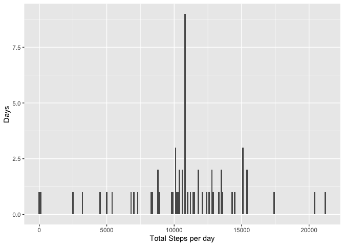

#The assignment
It is now possible to collect a large amount of data about personal movement using activity monitoring devices such as a Fitbit, Nike Fuelband, or Jawbone Up. These type of devices are part of the "quantified self" movement -- a group of enthusiasts who take measurements about themselves regularly to improve their health, to find patterns in their behavior, or because they are tech geeks. But these data remain under-utilized both because the raw data are hard to obtain and there is a lack of statistical methods and software for processing and interpreting the data.

This assignment makes use of data from a personal activity monitoring device. This device collects data at 5 minute intervals through out the day. The data consists of two months of data from an anonymous individual collected during the months of October and November, 2012 and include the number of steps taken in 5 minute intervals each day.

The data for the assignment was taken from the GitHub repository created for this assignment. The repository was forked and New project was created using the cloned Git Repo url and the working directory created on Desktop. The project as saved as RepData_PeerAssessment1 Direcory. The directory was set as working directory. The data file in the Directory "activity.zip" was used for the following assignment as per the following code

## Loading and preprocessing the data


```r
setwd("~/Desktop/RepData_PeerAssessment1") #the downloaded Repo was set as Working Directory
unzip("activity.zip") # the zip file containing the data was unzipped
DataActiv <- read.csv("activity.csv") # the unzipped file "activity.csv was imported by read.csv command into R Object DataActiv
DataActiv$date <- as.POSIXct(DataActiv$date) #data format changed to POSIXct
```


For this part of the assignment, you can ignore the missing values in the dataset.

Make a histogram of the total number of steps taken each day

Calculate and report the mean and median total number of steps taken per day


##Histogram of Total Number of Steps Taken Each Day


```r
DailySteps <- tapply(DataActiv$steps, DataActiv$date, sum, na.rm=T)
library(ggplot2)
qplot(DailySteps, xlab = "Total Steps per day", ylab = "Days", binwidth=100)
```

<!-- -->


## What is mean total number of steps taken per day?


```r
MeanStepsDaily <- mean(DailySteps)
paste("Mean Total Number of Daily Steps = ", MeanStepsDaily)
```

```
## [1] "Mean Total Number of Daily Steps =  9354.22950819672"
```
## what is the median number of steps taken each day?


```r
MedianStepsDaily <- median(DailySteps)
paste("Median Total Number of Daily Steps = ", MedianStepsDaily)
```

```
## [1] "Median Total Number of Daily Steps =  10395"
```

## What is the average daily activity pattern?
Make a time series plot (i.e. type = "l"type = "l") of the 5-minute interval (x-axis) and the average number of steps taken, averaged across all days (y-axis)


```r
Mean_Steps_Interval <- aggregate(DataActiv$steps, by=list(DataActiv$interval), FUN=mean, na.rm=T)
names(Mean_Steps_Interval) <- c("Interval", "Mean")

ggplot(Mean_Steps_Interval, aes( x = Interval, y = Mean)) + geom_line() + ggtitle("Average Daily Activity Pattern(Mean steps per 5min Interval)")
```

<!-- -->

##Which 5-minute interval, on average across all the days in the dataset, contains the maximum number of steps?


```r
Max_Steps <- which.max(Mean_Steps_Interval$Mean) 
# line No 104 has max mean steps value
Mean_Steps_Interval[104, ]
```

```
##     Interval     Mean
## 104      835 206.1698
```


## Imputing missing values
Calculate and report the total number of missing values in the dataset (i.e. the total number of rows with NAs)


```r
A <- sum(is.na(DataActiv$steps))
paste("Number of missing values =", A)
```

```
## [1] "Number of missing values = 2304"
```
Imputing the NA values in steps to mean steps

```r
library(Hmisc)
```

```
## Loading required package: lattice
```

```
## Loading required package: survival
```

```
## Loading required package: Formula
```

```
## 
## Attaching package: 'Hmisc'
```

```
## The following objects are masked from 'package:base':
## 
##     format.pval, units
```

```r
New_Imputed_Data_Active <- DataActiv

New_Imputed_Data_Active$steps <- impute(DataActiv$steps, fun=mean)
```

Histogram of the imputed new data


```r
DailySteps_imputed <- tapply(New_Imputed_Data_Active$steps, New_Imputed_Data_Active$date, sum)

qplot(DailySteps_imputed, xlab = "Total Steps per day", ylab = "Days", binwidth=100)
```

<!-- -->
Effect of imputing
Calculate and report the mean and median total number of steps taken per day. Do these values differ from the estimates from the first part of the assignment? What is the impact of imputing missing data on the estimates of the total daily number of steps?


```r
MeanStepsDaily <- mean(DailySteps)
paste("Mean Total Number of Daily Steps = ", MeanStepsDaily)
```

```
## [1] "Mean Total Number of Daily Steps =  9354.22950819672"
```

```r
MeanStepsDaily_after_imputing <- mean(DailySteps_imputed)
paste("Mean Total Number of Daily Steps after imputing = ", MeanStepsDaily_after_imputing)
```

```
## [1] "Mean Total Number of Daily Steps after imputing =  10766.1886792453"
```


```r
MedianStepsDaily <- median(DailySteps)
paste("Median Total Number of Daily Steps = ", MedianStepsDaily)
```

```
## [1] "Median Total Number of Daily Steps =  10395"
```

```r
MedianStepsDaily_after_imputing <- median(DailySteps_imputed)
paste("Median Total Number of Daily Steps after imputing = ", MedianStepsDaily_after_imputing)
```

```
## [1] "Median Total Number of Daily Steps after imputing =  10766.1886792453"
```
The mean and mediam number of daily steps after imputing the data are same that were different before imputing the steps column

## Are there differences in activity patterns between weekdays and weekends?


```r
DataActiv$week <- ifelse(weekdays(DataActiv$date) == "Sunday", "weekend", "weekday")

aggregateDataActiv <- aggregate(steps ~ interval + week, data=DataActiv, mean)
```

Let us make a time series plot using ggplot


```r
ggplot(aggregateDataActiv, aes(interval, steps)) +
  geom_line() + 
  facet_grid(week~.) +
  xlab("Steps at every 5 Minutes") +
  ylab("Average Steps")
```

<!-- -->

The plots shows that the activity on weekend starts late than on other days, however, the overall number of steps appeats to be more on weekend. 
